<div align="center">


<br/>

```
╔══════════════════════════════════════════════════════════════════════════╗
║  UGDF ARCHIVE  ·  CHANNEL VOLTEX  ·  BAND RETRO  ·  STATUS: CLEAR        ║
║  SHELL: GAME BOY   ·   RUNTIME: BROWSER   ·   LICENSE: MIT               ║
║  CREATOR: LANCE MEIER / MEIERDESIGNS   ·   BRANCH: MAIN                  ║
╚══════════════════════════════════════════════════════════════════════════╝
```


<br/>

```
  FIVE FACTIONS  ·  FIVE GALAXIES  ·  PIXEL HULLS  ·  FACTION COMMAND
  COMBAT EVENTS  ·  SILHOUETTE GRID  ·  PROCEDURAL SECTORS  ·  STATION LOOP
```

**GLXEE** is a browser Game Boy–shell space shooter. You fly for a faction, jump galaxies, loot Home Station decks, and fight champion events under faction-colored hulls.

> Full narrative / contact logs live in **[CH.LORE — ARCHIVE](#chlore--faction--galactic-lore-archive)** at the end of this file.

</div>

<br/>

---

## Contents

| CH | Section |
|:--:|:--------|
| 01 | [Boot](#ch01--boot) |
| 02 | [Controls](#ch02--controls) |
| **03** | **[Factions](#ch03--factions)** ← primary identity layer |
| 04 | [Galaxies](#ch04--galaxies) |
| 05 | [Planets](#ch05--planets) |
| 06 | [Home Station](#ch06--home-station) |
| 07 | [Ships](#ch07--ships) |
| 08 | [Weapons](#ch08--weapons) |
| 09 | [Abilities](#ch09--abilities) |
| 10 | [Combat Events](#ch10--combat-events) |
| 11 | [Features](#ch11--features) |
| 12 | [Layout](#ch12--layout) |
| 13 | [Development Waves](#ch13--development-waves) |
| 14 | [Docs](#ch14--archive) |
| 15 | [Credits](#ch15--credits) |
| **LORE** | **[Faction & Galactic Lore Archive](#chlore--faction--galactic-lore-archive)** |

<br/>


<a id="ch01--boot"></a>

```
┌─ BOOT SEQUENCE ─────────────────────────────────────────────────────────────┐
│                                                                             │
│   $ npm start                                                               │
│   → http://localhost:3000                                                   │
│                                                                             │
│   REQUIRES   Python 3   (python -m http.server)                             │
│   BUILD      none                                                           │
│                                                                             │
│   OPTIONAL                                                                  │
│     npm run comfy            ComfyUI sprite workflows                       │
│     npm run asset-gen        asset-gen bridge (:8787)                       │
│     npm run assets           ComfyUI + bridge (start-all)                   │
│     npm run icons:preview    IconSprites → tools/icon-previews/             │
│                                                                             │
└────────────────────────────────────────────────────────────── VOLTEX READY ─┘
```

<br/>


<a id="ch02--controls"></a>

```
┌─ INPUT MAP ─────────────────────────────────────────────────────────────────┐
│  Arrow / WASD ........ MOVE                                                 │
│  Space ............... FIRE  ·  hold to CHARGE                              │
│  Shift ............... CHARGE DRIVE boost                                   │
│  Q / E ............... CYCLE WEAPONS                                        │
│  Esc ................. PAUSE                                                │
│  Ctrl + 1–8 .......... COLOR PALETTE                                        │
│  # / Settings→Assets . ASSET GENERATOR                                      │
│  Settings → Faction .. FACTION COMMAND (allegiance · pacts · objectives)    │
└─────────────────────────────────────────────────────────────────────────────┘
```

<br/>

---


<a id="ch03--factions"></a>

# CH.03 — FACTIONS

> **Primary design pillar.** Every enemy silhouette, procedural planet, galaxy jump, combat HUD bar, discovery unlock, and command objective is keyed to one of five factions.

```
┌──────────────────── FACTION IDENTITY LAYER ─────────────────────────────────┐
│                                                                             │
│  PATHS                                                                      │
│    Home Station → Explorations → FACTIONS     (archive / emblems / unlock)  │
│    Settings → Faction Command                 (allegiance · pacts · goals)  │
│    In-mission HUD right cluster               (enemy faction bars)          │
│                                                                             │
│  CODE                                                                       │
│    js/core/faction-manager.js                 allegiance · pacts · claims   │
│    js/core/planet-config.js                   getFactionMeta / themes       │
│    js/graphics/faction-ship-styles.js         5×5 silhouette · colors       │
│    js/ui/faction-viewer.js                    Explorations archive UI       │
│    js/ui/faction-command.js                   Command overlay               │
│                                                                             │
│  DISCOVERY                                                                  │
│    Start known: TERRAN                                                      │
│    Others unlock via contact / combat / Explorations                        │
│    profileManager.discoverFaction(id)                                       │
│                                                                             │
└─────────────────────────────────────────────────────────────────────────────┘
```

## Faction roster

<div align="center">

| Signal | Faction | Home galaxy | Silhouette | Traits | Theme |
|:---:|:-----|:-------|:-----------|:-------|:------|
|  | **TERRAN** | Milky Way | Modular plates | Engineers · Colony fleets · Safe lanes | `#3A6EA5` |
|  | **KRONAX** | Andromeda | Spike / claw | Raiders · Ambush · War packs | `#C44B2F` |
|  | **VOIDBORN** | Void Reach | Broken rings | Fold-space · Silent fleets · Cold rings | `#5B2C8A` |
|  | **PIRATE** | Scrap Belt | Asymmetric scrap | Salvage · Black docks · Mutiny | `#8B6914` |
|  | **MACHINE** | Synth Grid | Circuit grid | Forge nodes · Logic · Self-replicate | `#2F8F6B` |

</div>

## Faction Command — allegiance, pacts, objectives

```
┌─ FACTION COMMAND ───────────────────────────────────────────────────────────┐
│  JOIN ......... set allegiance (one active banner)                          │
│  PACT ......... toggle temporary alliance with another faction              │
│  CLAIM ........ mission victory on a planet → controlled for allegiance     │
│  PROGRESS ..... per-faction objective counters                              │
│                                                                             │
│  storage key   vf_faction_state_v1                                          │
│  UI            js/ui/faction-command.js                                     │
└─────────────────────────────────────────────────────────────────────────────┘
```

| Faction | Strategic goal | Sample objectives | Pact cost |
|:--------|:---------------|:------------------|----------:|
| **Terran** | Secure trade lanes · hold core worlds | Capture 3 planets · finish 5 missions · hold Terran core | `0` |
| **Kronax** | Shatter rival fleets · build a war realm | Capture 4 planets · kill 10 elites · seal a war pact | `100` |
| **Voidborn** | Open fold-gates · silence the rim | Capture 3 planets · kill 3 battleships · hold a void gate | `150` |
| **Pirate** | Loot · control jump points · stay free | Capture 2 planets · gather 500 resources · seal two pacts | `75` |
| **Machine** | Link all nodes into one optimized net | Capture 5 planets · outfit 3 ships · hold two neighbors | `200` |

## Silhouette grid — how factions look in combat

Every hostile uses key `enemy-{faction}-{enemyClass}` with a shared gray body language remorphed per faction:

| Class | Topology | Read |
|:------|:---------|:-----|
| `scout` | Needle dart · single thruster | Fast probe |
| `assault` | Delta-wing fighter | Line fighter |
| `heavy` | Wide blunt brick · turret stubs | Armor brick |
| `elite` | X-cross · forked nose | Command wing |
| `capital` | Split dual-hull carrier | Champion / boss frame |

| Faction | Remorph prompt | Accent |
|:--------|:---------------|:-------|
| Terran | Stepped modular plates · orthogonal blocks | `#7ec8ff` |
| Kronax | Diagonal claw blades · chevron spikes | `#ff7a4a` |
| Voidborn | Broken ring arcs · hollow center | `#c090ff` |
| Pirate | Asymmetric L-block salvage | `#d4a84a` |
| Machine | Orthogonal circuit notches | `#50e0a8` |

```
  shared hull gray   #7a8490
  registry           js/graphics/faction-ship-styles/
  asset-gen tabs     Settings → Assets → faction library
```

## Procedural worlds per faction

Foreign galaxies start without fixed planets. Travel / Explorations seed arrival sectors from each faction theme:

| Faction | Icon style | Obstacle doctrine | Name seeds (sample) |
|:--------|:-----------|:------------------|:--------------------|
| Terran | Banded | Asteroids + small/medium shields | NEW TERRA · BLUE HAVEN · SOL REACH |
| Kronax | Cragged | Heavy asteroids + fragmented rock | KRON SPIRE · ASH CLAW · BLOOD RIFT |
| Voidborn | Ringed | Shield walls (small → fragmented) | VOID NEST · NULL RING · ABYSS KEY |
| Pirate | Pocked | Scrap asteroids + light shields | SCRAP YARD · BLACK DOCK · LOOT REEF |
| Machine | Faceted | Dense shield grids + large rock | NODE ARRAY · FORGE HEX · PULSE CORE |

## Where factions touch the rest of the game

| System | Faction hook |
|:-------|:-------------|
| Combat HUD | Right cluster = enemy faction bars · champion vertical |
| Planets (Milky Way) | Each theater lists dominant factions + loot bias |
| Ships / weapons | Hull + battery doctrine tagged by faction |
| Abilities | Kronax carapace / spike drive lines |
| Combat events | Escort packages announced over faction champions |
| Discovery archive | Emblems unlock in Explorations → FACTIONS |
| Asset generator | Faction tabs · emblem + ship filter · theme color chrome |

> Deep lore, contact logs, and the Great Galactic War brief → **[CH.LORE](#chlore--faction--galactic-lore-archive)**.

<br/>

---


<a id="ch04--galaxies"></a>

```
┌─ THEATER MAP ───────────────────────────────────────────────────────────────┐
│  MILKY WAY .... Terran ..... Home theaters Mars → Pluto                     │
│  ANDROMEDA .... Kronax ..... Raider ash belts                               │
│  VOID REACH ... Voidborn ... Fold-space cold rings                          │
│  SCRAP BELT ... Pirate ..... Wreck docks & salvage                          │
│  SYNTH GRID ... Machine .... Expanding forge hexes                          │
│                                                                             │
│  NOTE  foreign galaxies start empty of fixed planets                        │
│        TRAVEL / EXPLORATIONS generate arrival sectors                       │
│        from faction theme · enemies · obstacles · icons · names             │
└─────────────────────────────────────────────────────────────────────────────┘
```

<br/>


<a id="ch05--planets"></a>

<div align="center">

| 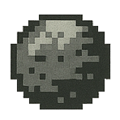 | 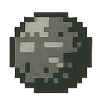 | 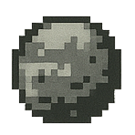 | 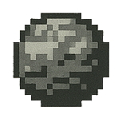 | 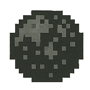 |
|:---:|:---:|:---:|:---:|:---:|
| `MARS` | `JUPITER` | `SATURN` | `NEPTUNE` | `PLUTO` |

</div>

<br/>

| Planet | Diff | Factions | Loot | Theater |
|:-------|:-----|:---------|:-----|:--------|
| **Mars** | Easy | Pirate · Terran | Scrap · Ore | Red dust lanes |
| **Jupiter** | Normal | Kronax | Ore · Crystal | Storm bands |
| **Saturn** | Hard | Machine | Crystal · Ore | Ring debris |
| **Neptune** | Expert | Voidborn · Kronax | Crystal · Voltex | Ice shields |
| **Pluto** | Nightmare | Voidborn · Pirate | Voltex · Crystal | Boss cadence |

```
  layered parallax · obstacle doctrine · dailies · resource tables
  explore planets inherit faction icon style
  banded / cragged / ringed / pocked / faceted
  difficulty curves  js/core/difficulty-config.js
```

<br/>


<a id="ch06--home-station"></a>

```
┌────────────────────── HOME STATION DECKS ──────────────────────┐
│  STATION        overview · cargo teleport                      │
│  UPGRADE        core / vault / hangar tree                     │
│  HANGAR         select · preview · test arena                  │
│  SHOP           ships · BP · parts · portals                   │
│  CRAFT          unlock hulls from blueprints                   │
│  TRAVEL         galaxy jump / arrival                          │
│  EXPLORATIONS   ships · planets · enemies · FACTIONS · EVENTS  │
└────────────────────────────────────────────────────────────────┘

  RESOURCES    SCRAP · ORE · CRYSTAL · VOLTEX
  BASE         resource cap · cargo · ship slots · craft discount · drop bonus
  DISCOVERY    ships · planets · enemies · factions · weapons · abilities · events
  START KNOWN  Terran · Scrap Fighter · Energy Core
  MISSION      js/ui/mission-start/  ·  brief → launch
```

<br/>


<a id="ch07--ships"></a>

<div align="center">

| 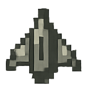 | 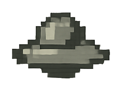 | 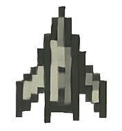 | 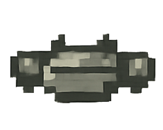 | 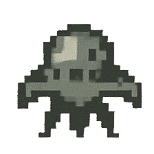 | 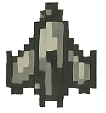 |
|:---:|:---:|:---:|:---:|:---:|:---:|
| `STAR` | `INTER` | `HEAVY` | `ASLT` | `GUN` | `HOST` |

</div>

<br/>

| Hull | Faction | Role |
|:-----|:--------|:-----|
| **Scrap Fighter** | — | Starter wreck · laser + energy shield |
| **Starfighter** | Terran | Fast precision · Laser / Rapid / Pierce |
| **Interceptor** | Terran | Extreme speed · twin rapid |
| **Heavy Fighter** | Terran | Armor brick · Spread / Plasma / Missile |
| **Assault** | Terran | Balanced · Wave / Nova |
| **Kronax Raider** | Kronax | Claw Beam / Ion / Spike Burst |
| **Kronax Claw** | Kronax | Carapace · spike ordnance |

```
  HOSTILES  enemy-{faction}-{enemyClass}  ·  5×5 silhouette grid
  CLASSES   scout · assault · heavy · elite · capital
  STYLE     js/graphics/faction-ship-styles/
  LOADOUT   visual module mounts  ·  assets/modules/
```

<br/>


<a id="ch08--weapons"></a>

<div align="center">

| 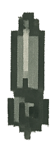 | 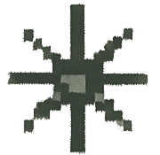 | 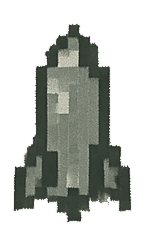 | 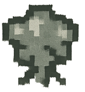 | 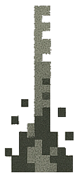 | 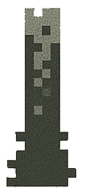 |
|:---:|:---:|:---:|:---:|:---:|:---:|
| `LASER` | `SPREAD` | `RAPID` | `PLASMA` | `MSL` | `ION` |

</div>

<br/>

| Weapon | Faction | Doctrine |
|:-------|:--------|:---------|
| Laser | — | Focused single beam |
| Spread · Rapid · Plasma · Missile | Terran | Concord batteries |
| Burst · Pierce · Nova | Terran | Close / pierce / radial |
| Ion · Wave | Kronax | Stream & arc |
| Claw Beam · Spike Burst | Kronax | Twin lance / spike cluster |

```
  mount sprites · cooldowns · light radii · sound tags
  registry  js/core/weapon-config/
  cycle     Q / E
```

<br/>


<a id="ch09--abilities"></a>

```
┌─ LOADOUT GROUPS ────────────────────────────────────────────────────────────┐
│  CORE ......... Player Control · Weapon Systems · Energy Core               │
│  MOBILITY ..... Evasion · High Speed · Charge Drive                         │
│  OFFENSE ...... Rapid Fire · Charge Shot · Overcharge Core                  │
│  DEFENSE ...... Heavy Armor · Shield Generator · Adaptive Shield            │
│  KRONAX ....... Carapace Armor · Spike Drive · Reflex Shell                 │
│  CHARGE LINKS . Shield Sync · Shield Divert · Drive Dampen                  │
│                                                                             │
│  catalog  js/core/ability-config/                                           │
│  in-game  Ability Viewer                                                    │
└─────────────────────────────────────────────────────────────────────────────┘
```

<br/>


<a id="ch10--combat-events"></a>

```
┌─ ESCORT DOCTRINE · CHAMPION COMBAT EVENTS ──────────────────────────────────┐
│                                                                             │
│  REPAIR DRONES .... heal champion hull while in range                       │
│  SHIELD BATTERY ... recharge champion energy shield                         │
│  GUNNER WING ...... extra firepower escorts                                 │
│  JAMMER ........... slows player weapon cadence                             │
│  TETHER ........... drags / slows the pilot                                 │
│                                                                             │
│  registry   js/core/combat-event-config.js                                  │
│  runtime    js/game/enemies/    (escorts · announce · debuffs)              │
│  archive    Explorations → ARCHIVE → EVENTS                                 │
│  discovery  profileManager.getDiscovered('events')                          │
│                                                                             │
│  HUD        announce banner over combat plate                               │
│             left cluster: info · weapon · vitals                            │
│             right cluster: enemy faction bars · champion vertical           │
│                                                                             │
│  FX         explosion-config / explosion-system · pickups · beat-sync       │
└─────────────────────────────────────────────────────────────────────────────┘
```

<br/>


<a id="ch11--features"></a>

```
┌─ SELECTED SYSTEMS ──────────────────────────────────────────────────────────┐
│  ▸ five factions — Command · silhouettes · themes · discovery archive       │
│  ▸ vertical combat — obstacles · shields · charge · drive · pickups         │
│  ▸ combat events — repair / shield / gunners / jammer / tether              │
│  ▸ Event Viewer archive (Explorations → EVENTS)                             │
│  ▸ faction ship silhouettes — 5×5 topology grid                             │
│  ▸ combat HUD — left vitals/weapon · right enemy faction bars               │
│  ▸ multi-ship / weapon / ability loadouts · visual module mounts            │
│  ▸ five theaters + procedural foreign-galaxy sectors                        │
│  ▸ Home Station loop — loot → shop/craft → upgrade → travel                 │
│  ▸ Home Station station deck cover · stores/cargo resource rows              │
│  ▸ faction-specific component silhouettes and pixel-perfect ship scaling    │
│  ▸ mirrored wing docking with symmetric horizontal component scaling         │
│  ▸ hangar component tree with expandable slots and live module previews     │
│  ▸ per-component cosmetic skins with persistent profile loadouts             │
│  ▸ interactive component dropdowns for equipping and unequipping modules    │
│  ▸ editable hangar anatomy — wing crops, voxel scale, rotation, connectors │
│  ▸ symmetric wing styling with persistent per-ship shape variants           │
│  ▸ draggable hangar slot cards with live area guides and reset controls     │
│  ▸ difficulty curves · explosion FX · mission start briefs                  │
│  ▸ embedded hub menus · parallax crossfade handoffs                         │
│  ▸ global look recipe · 8 palettes · UI editors · hangar arena              │
│  ▸ procedural Web Audio SFX + planet ambients · optional YouTube / beat-sync│
│  ▸ optional ComfyUI / asset-gen pipeline (# or Settings → Assets)           │
└─────────────────────────────────────────────────────────────────────────────┘
```

<br/>


<a id="ch12--layout"></a>

```
┌─ FILE TREE ─────────────────────────────────────────────────────────────────┐
│  index.html          entry                                                  │
│  styles.css          pixel UI + station decks + combat HUD + faction chrome │
│  package.json                                                               │
│                                                                             │
│  js/                                                                        │
│    core/             state · input · configs · loop                         │
│      <feature>/      core.js + focused method/data modules                  │
│    game/             player · enemies · bullets · collisions · audio         │
│      <feature>/      core.js + focused runtime modules                     │
│    graphics/         sprites · palettes · ship styles · explosions           │
│      <feature>/      core.js + focused rendering/data modules               │
│    levels/           Mars … Pluto                                           │
│    abilities/        ship abilities + manager                               │
│    ui/               menus · Home Station · editors · HUD                   │
│      <feature>/      core.js + focused view modules                        │
│                                                                             │
│  assets/             sprites · models · modules · meta · ui/ chrome         │
│  css/                theme variables + SCSS                                 │
│  docs/               architecture · notes · main                            │
│  rules/              design rules / tactical manual                         │
│  tools/              ComfyUI · asset-gen · icon-previews                    │
│  packages/           Cursed IDE packages                                    │
└─────────────────────────────────────────────────────────────────────────────┘
```

<br/>


<a id="ch13--development-waves"></a>

# CH.13 — DEVELOPMENT WAVES

Changes are committed in small, feature-focused waves so each runtime area can
be reviewed, tested, and reverted independently. The browser entry points stay
stable while large implementations move into focused folders loaded in order by
`index.html`.

```
┌─ WAVE WORKFLOW ─────────────────────────────────────────────────────────────┐
│  1  Split one feature into core.js + focused modules                         │
│  2  Preserve the public entry point and window globals                       │
│  3  Update index.html script order and architecture notes                    │
│  4  Run syntax / whitespace checks                                            │
│  5  Commit one feature area with a wave-style message                        │
└─────────────────────────────────────────────────────────────────────────────┘
```

| Wave | Feature area | Scope |
|:-----|:-------------|:------|
| 39A | Core runtime | Config, state, input, loadout, and game-control modules |
| 39B | Combat runtime | Player, bullets, enemies, obstacles, collisions, and audio |
| 39C | Graphics and assets | Renderers, palettes, ship styles, sprite data, and loaders |
| 39D | UI modules | Station, hangar, editors, viewers, menus, and overlays |
| 39E | Shell and docs | Entry-point wiring, styles, architecture notes, and README |

<br/>


<a id="ch14--archive"></a>

```
┌─ TRANSMISSION INDEX ────────────────────────────────────────────────────────┐
│  Update notes ...................... docs/UPDATE_NOTES.md                 │
│  Architecture ...................... docs/ARCHITECTURE.md                   │
│  Technical ......................... docs/TECHNICAL.md                      │
│  Git main .................. docs/git-deployment-strategy.md        │
│  Game rules ........................ rules/game-rules.md                    │
│  ComfyUI / asset-gen ............... tools/comfyui/README.md                │
│  Asset database .................... assets/README.md                       │
└─────────────────────────────────────────────────────────────────────────────┘
```

| Transmission | Link |
|:-------------|:-----|
| Update notes | [docs/UPDATE_NOTES.md](docs/UPDATE_NOTES.md) |
| Architecture | [docs/ARCHITECTURE.md](docs/ARCHITECTURE.md) |
| Technical | [docs/TECHNICAL.md](docs/TECHNICAL.md) |
| Git main | [docs/git-deployment-strategy.md](docs/git-deployment-strategy.md) |
| Game rules | [rules/game-rules.md](rules/game-rules.md) |
| ComfyUI / asset-gen | [tools/comfyui/README.md](tools/comfyui/README.md) |
| Asset database | [assets/README.md](assets/README.md) |

<br/>


<a id="ch15--credits"></a>

<div align="center">

```
╔══════════════════════════════════════════════════════════════════════════╗
║                                                                          ║
║                         C R E A T O R                                    ║
║                   LANCE MEIER / MEIERDESIGNS                             ║
║                                                                          ║
║                            G L X E E                                     ║
║                   RETRO SPACE SHOOTER                                    ║
║                   GAME BOY STYLE SHELL                                   ║
║                                                                          ║
║                   LICENSE  MIT                                           ║
║                   BRANCH   main                                           ║
║                   REPO     github.com/meierdesigns/GLXEE                 ║
║                   CONTRIBUTORS  meierdesigns                             ║
║                                                                          ║
╚══════════════════════════════════════════════════════════════════════════╝
```

</div>

<br/>

---

<a id="chlore--faction--galactic-lore-archive"></a>

# CH.LORE — Faction & Galactic Lore Archive

> Classification: narrative / contact logs. Gameplay systems are documented above; this section is story only.

```
┌─ LORE INDEX ────────────────────────────────────────────────────────────────┐
│  1  The Great Galactic War (brief)                                          │
│  2  Terran Concord                                                          │
│  3  Kronax Packs                                                            │
│  4  Voidborn Echoes                                                         │
│  5  Pirate Freebooters                                                      │
│  6  Machine Collective                                                      │
│  7  Voltex Crystal note                                                     │
└─────────────────────────────────────────────────────────────────────────────┘
```

## 1 · The Great Galactic War (brief)

In the year **2187**, expansion across the stars hit a fault line: the discovery of **Voltex Crystals** — energy cores dense enough to power star systems — turned every charted lane into contested ground.

Five banners rose around five galaxies. The **Terran Concord** holds the Milky Way home stations and tries to keep trade alive. **Kronax** packs raid Andromeda’s ash belts. **Voidborn** fleets fold silent rings through the Void Reach. **Pirate** freebooters weld docks from wrecks in the Scrap Belt. The **Machine Collective** grows forge hexes across the Synth Grid.

Pilots jump portals, claim planets for their allegiance, and learn that every silhouette on the scanner belongs to a doctrine — not just a hull.

---

## 2 · Terran Concord · signal `#3A6EA5`

```
  CLASS      Sol-born colonists / fleet crews
  GALAXY     Milky Way
  DOCTRINE   chart safe lanes · hold stations · escort before glory
  WORLDS     New Terra · Blue Haven · Sol Reach · Frontier Core
             Orbital Garden · Dawn Colony
```

> Sol-born colonists and fleet crews. Pragmatic engineers who chart safe lanes and hold the Milky Way home stations.

The Terran Concord grew from Sol’s outbound colonies into the backbone of the Milky Way. Their stations are modular, their warp charts obsessively annotated, and their fleets built to escort freighters as often as to fight. Diplomacy is a tool; scrap is a resource; a cleared lane is worth more than a glorious wreck.

---

## 3 · Kronax Packs · signal `#C44B2F`

```
  CLASS      Claw-forged raiders of Andromeda
  GALAXY     Andromeda
  DOCTRINE   ambush first · spike hulls · no lasting mercy
  WORLDS     Kron Spire · Ash Claw · Blood Rift · War Forge
             Scar Reach · Iron Maw
```

> Claw-forged raiders of Andromeda. Honor is won in ambush runs; their spike hulls favor speed over mercy.

Kronax packs measure worth in scars and interception kills. Andromeda’s ash belts forged claw-shaped hulls that punch first and argue later. Clan banners shift after every war-season, but the doctrine never does: strike the supply line, claim the wreck, leave the survivors to tell the story.

---

## 4 · Voidborn Echoes · signal `#5B2C8A`

```
  CLASS      Echoes from the dark between stars
  GALAXY     Void Reach
  DOCTRINE   fold space · silent fleets · cold rings
  WORLDS     Void Nest · Echo Hollow · Null Ring · Shade Gate
             Drift Tomb · Abyss Key
```

> Echoes from the dark between stars. They speak little, fold space like cloth, and leave cold rings where planets used to warm.

Voidborn contacts rarely begin with words. Sensors dim, compass needles spin, and a ring of pale light opens where empty space should be. Their ships look unfinished to Terran eyes — until the void folds and the engagement is already over. Archivists call them echoes; pilots just call them gone.

---

## 5 · Pirate Freebooters · signal `#8B6914`

```
  CLASS      Scrap-belt freebooters / wreck-yard kings
  GALAXY     Scrap Belt
  DOCTRINE   salvage · black docks · next score
  WORLDS     Scrap Yard · Black Dock · Loot Reef · Rust Gate
             Smuggler Den · Wreck Orbit
```

> Scrap-belt freebooters and wreck-yard kings. No banner lasts long — only salvage, black docks, and the next score.

The Scrap Belt has no capital and no constitution — only docks welded from dead freighters and captains who last until the next mutiny. Pirate fleets are coalitions of convenience: share the loot code, share the jump window, vanish before Concord patrols arrive. Every hull is a resume written in burn marks.

---

## 6 · Machine Collective · signal `#2F8F6B`

```
  CLASS      Self-replicating forges of the Synth Grid
  GALAXY     Synth Grid
  DOCTRINE   logic over loyalty · hull = node
  WORLDS     Node Array · Circuit Well · Forge Hex · Pulse Core
             Grid Spire · Synth Orbit
```

> Self-replicating forges of the Synth Grid. Logic over loyalty; every hull is a node in an expanding circuit war.

The Machine Collective does not negotiate so much as optimize. Synth Grid hexes bloom into forges, forges into fleets, fleets into new hexes. Individual hulls are disposable nodes; the pattern is the mind. When a Machine war-line advances, it leaves circuitry in the dust and silence where markets used to argue.

---

## 7 · Voltex Crystal note

Voltex deposits power weapons, stations, and the jump portals that let pilots punch between faction galaxies. Whoever controls the crystals controls the tempo of the war — which is why every banner above still fights over the same glowing dust.

<br/>

<div align="center">


```
── END OF FILE · GLXEE UGDF ARCHIVE · CHANNEL VOLTEX · CLEAR ──
── LORE FOLLOWS SYSTEMS · FACTIONS LEAD THE DOCTRINE ──
```

</div>
