<div align="center">


# GLXEE

**A browser-based Game Boy–shell space shooter about factions, loadouts, and the next jump.**

[](#boot)
[](#credits)
[](#credits)
[](#factions-and-galaxies)
[](https://meierdesigns.itch.io/glxee)

</div>

**Play free in the browser:** [meierdesigns.itch.io/glxee](https://meierdesigns.itch.io/glxee)

GLXEE is a no-build browser shooter. Choose a faction, assemble a ship from
area-sized modules, clear planets, earn contracts, trade with allies, and travel
through five faction-themed galaxies. Its identity is carried by pixel shapes,
not just color: every faction has its own silhouette, doctrine, and visual
language.

```text
╭────────────────────────────── VOLTEX CHANNEL ──────────────────────────────╮
│  PILOT STATUS   READY                                                       │
│  THEATER         MILKY WAY · MARS                                           │
│  LOADOUT         NOSE  M   CORE  S   AFT  M   WINGS  S/S                    │
│  OBJECTIVE       CLEAR THE STAGE · CLAIM THE LOOT                           │
│  NEXT JUMP       HOME STATION → TRAVEL → UNKNOWN SECTOR                     │
│  PLAY            https://meierdesigns.itch.io/glxee                         │
╰─────────────────────────────────────────────────────────────────────────────╯
```

<div align="center">

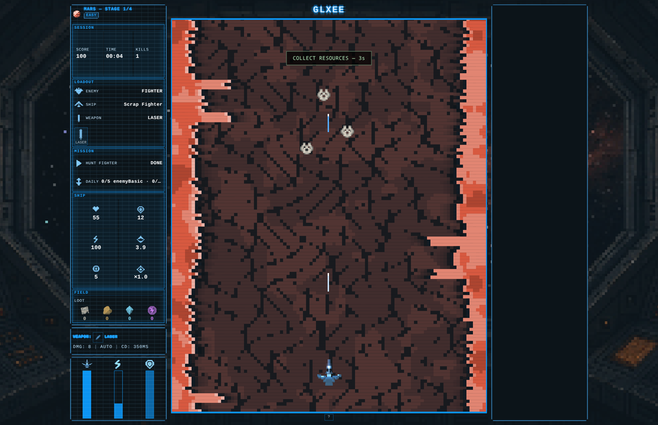

<br/>

`COMBAT  ·  MARS STAGE  ·  FACTION BARS  ·  LOADOUT RAIL`

<br/>

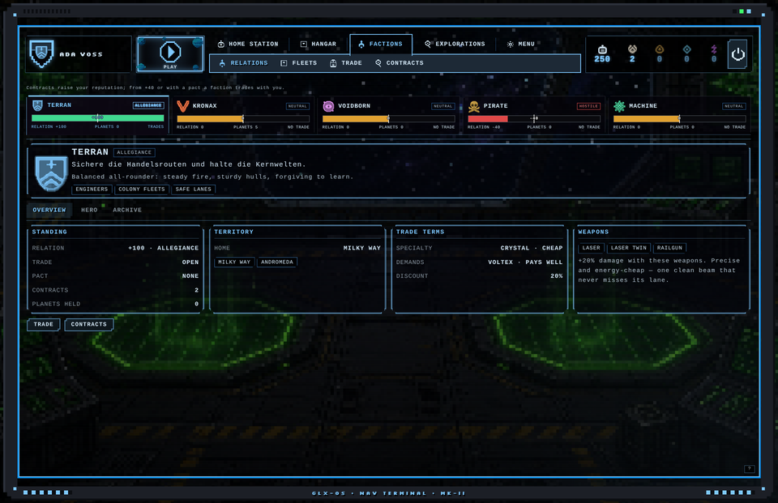

<br/>

`FACTIONS  ·  RELATIONS  ·  TRADE  ·  CONTRACTS`

</div>

> **Design rule:** the README follows the game loop. Boot and controls come
> first, systems are described once in their owning section, and development
> history stays at the end.

## Contents

- [Boot](#boot)
- [Controls](#controls)
- [The game loop](#the-game-loop)
- [Factions and galaxies](#factions-and-galaxies)
- [Home Station and hangar](#home-station-and-hangar)
- [Combat](#combat)
- [Screenshots](#screenshots)
- [Features](#features)
- [Architecture](#architecture)
- [Development waves](#development-waves)
- [Documentation](#documentation)
- [Lore](#lore)
- [Credits](#credits)


## Boot

Requirements: **Python 3**. There is no build step and no dependency install.

```bash
npm start
# http://localhost:3000
```

`npm start` / `npm run dev` / `npm run serve` run `tools/dev-server.py`: a threaded
**HTTP/1.1** static server with keep-alive (the page pulls hundreds of files),
quiet request logs, and `Cache-Control: no-cache` so F5 stays fast (304 when
unchanged) while edits still appear. Equivalent plain server:

```bash
python3 -m http.server 3000
```

Silkscreen is **self-hosted** under `assets/fonts/` (no Google Fonts round trip),
preloaded in `index.html`, and declared in `css/fonts.css`. A solid **boot veil**
covers the shell until the start menu is restored.

`js/core/stage-boot.js` runs in `<head>` and locks a fixed **1280×960 (4:3)**
logical stage plus `--stage-scale` before first paint, sizing the stage to
**95 %** of the window (same fill rule as `viewport-fit.js`). The last known
faction styles the outer **bezel** immediately (`data-vf-faction`), and
`vf-loading` holds transitions off until load settles. Cached **GUI voxel** and
**pixel-frame** look apply before first paint so the bezel never starts smooth
and then snaps.

A **loading screen** paints with the first frame (critical CSS in `index.html`):
GLXEE brand, VOLTEX channel line, progress bar, and phase status
(`OPENING CHANNEL` → `LINKING SYSTEMS` → `FONT LOCK` → `RESTORING MENU`).
`js/core/boot-loader.js` tracks stylesheet/script resource progress; `GameCore`
advances phases while restoring the menu, then fades the veil out. On a plain
**refresh** in the same tab session the progress panel stays hidden — only a
calm veil covers the stage (under the bezel) so the UI never visibly rebuilds.

Optional local tools:

```bash
npm run assets          # ComfyUI + asset-gen bridge
npm run comfy           # ComfyUI workflows
npm run asset-gen       # asset-gen bridge on :8787
npm run icons:preview   # render icon previews
```

Run the server from the repository root.


## Controls

| Input | Action |
|:------|:-------|
| Arrow keys / WASD | Move |
| Space | Fire; hold to charge |
| Shift | Charge Drive boost |
| Q / E | Cycle weapons |
| Escape | Pause; switch menu groups in the station |
| Ctrl + 1–8 | Select color palette |
| `#` or Settings → Assets | Open Asset Generator |
| Settings → Faction | Open Faction Command |

Menu navigation is keyboard-first: arrow keys move focus, Enter confirms, and
Escape closes the active overlay. Text fields keep their normal caret controls.

## The game loop

```text
Choose profile
    ↓
Home Station: upgrade · shop · craft · hangar · missions · factions
    ↓
Accept a planet, faction, or bounty contract
    ↓
Travel / launch → clear stages → collect loot and mission rewards
    ↓
Upgrade hull areas and slots · trade · change the loadout · jump again
```

A mission is either a **LIBERATE** run on an uncleared planet or a lower-paying
**PATROL** on a cleared one. One mission can be active at a time. Faction
contracts can target reachable galaxies and may teleport the pilot before launch.


## Factions and galaxies

Five factions define the main theaters. Their silhouette rules, procedural planet
styles, enemy pools, and strategic goals are shared by combat and exploration.

| Faction | Galaxy | Silhouette language | Doctrine |
|:--------|:-------|:--------------------|:---------|
| **Terran** | Milky Way | Modular plates | Engineers, escorts, safe lanes |
| **Kronax** | Andromeda | Claws and spikes | Ambush, speed, war packs |
| **Voidborn** | Void Reach | Broken rings | Fold-space, silent fleets |
| **Pirate** | Scrap Belt | Asymmetric scrap | Salvage, black docks, mutiny |
| **Machine** | Synth Grid | Circuit grids | Logic, forge nodes, replication |

Foreign galaxies begin with generated arrival sectors. Faction themes seed
planet names, obstacle doctrine, enemy compositions, icons, and background
patterns. Reputation ranges from -100 to +100; allegiance, pacts, and contracts
change whether a faction trades and which prices it offers.

<div align="center">

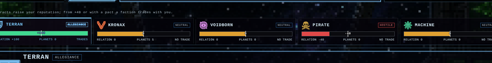

<br/>

`TERRAN` · `KRONAX` · `VOIDBORN` · `PIRATE` · `MACHINE`

<br/>


<br/>

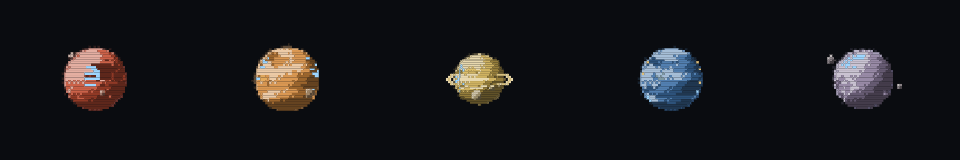

<br/>

`MARS` · `JUPITER` · `SATURN` · `NEPTUNE` · `PLUTO`

</div>

Large UI surfaces (crest, relations cards, profile modal) draw **hand-shaded
32×32 emblems** through the `@2x` / `@4x` icon path instead of a blocky upscale
of the 16×16 silhouettes. Resource chips use the same hi-res treatment. The
Pirate seal is an angular void-skull over crossed boarding cleavers — harsh on
both the 16px HUD badge and the enlarged `@4x` crest.

### Faction relations and contracts

The Home Station Factions area has focused views:

- **Relations:** reputation meter, allegiance, pacts, controlled planets, and lore.
- **Fleets:** live formation preview with zoom; the pilot's ship fights back at
  the bottom. Faction colour overrides update the preview live; a **player-only**
  filter focuses the active hull.
- **Trade:** faction specialties, demanded resources, buy/sell quotes, and relation discounts.
- **Contracts:** faction jobs and bounty hunts in reachable galaxies.

Contracts pay credits and materials when the target planet stage is cleared and
raise reputation with the issuing faction.

### Galactic control

Each galaxy has a faction ruler, a hidden base, and a faction-specific expansion
pattern. Flights and cleared battles advance the control simulation:

- factions found outposts, war camps, sanctums, hideouts, or relays;
- holdings add defenders and faction-specific parts to their trading stations;
- stations can be raided, and destroying every station exposes the base;
- destroying the base changes a held galaxy to contested control;
- a new profile begins with a seeded home-galaxy invasion that can be repelled
  for an opening reward.

**Shared world ownership:** clearing a planet claims it for the pilot's faction
in a global `galaxy.owners` map (latest clear wins). Holding more than half of
a galaxy's planets makes that faction the ruler for every pilot; rivals keep
the galaxy **CONTESTED**. Built-in control presets bump with `GALAXY_CONTROL_REV`
so saved galaxies pick up new ally/rival rules.

**Ally defense:** when an allied faction's home galaxy is invaded by a common
enemy, the pilot can fly there to repel it for bonus credits, scrap, and
reputation with the ally.

**Custom galaxies:** the main-menu **GALAXIES** viewer browses every shared
galaxy (ruler emblems, map, planets). Pilots can generate a named start galaxy
at creation (planet count, difficulty tier, suns, rivals) or open NEW GALAXY
from the viewer; unused generated galaxies can be deleted. The viewer remembers
selected focus and column scroll positions across sessions.

**Universe save:** from the GALAXIES viewer, download or upload a single
`glxee-universe-*.json` that packages every galaxy, planet config, custom
cluster/pattern, faction state, and pilot profile. Restoring writes the same
localStorage keys the managers use and reloads cleanly.

Trading posts remember which faction **built** them (`stationBuilders`), so a
post keeps its builder's look after the anchor planet changes hands. Posts are
placed with edge awareness so they sit on reachable lanes.

Planet cards on the explore map show atmosphere haze from the live SVG palette.
Map art is built from a shared **pixel unit**: planets, suns, and nebula cells
use one pixel size per zoom step, and planet size classes add pixels instead of
making pixels bigger. Suns carry a noise surface that gains octaves when you zoom.
Nebulae are posterised into hard steps (no smooth gradients), mix coarse and fine
grain, keep dark voids and translucent veils, and glow on their own in a few
pockets; only some suns carry a nebula and its colour follows the sun while
brightness falls with distance. Free-floating vortices are static. The coarse
field is stored in the browser per galaxy and prepared at boot, so a reload
shows it at once; fine patches snap to a tile grid so small pans reuse finished
work. Stage counts under planets show on hover only. Border **checkpoints** use faction silhouette
art. Route beams carry **bidirectional data-packet traffic**. A **ship locator**
recenters the map. Explore budget sits in a progress chip; the **ruler bar**
stacks planet / situation / action segments. Selecting a border, planet, or
station updates the confirm row:

| Selection | Actions |
|:----------|:--------|
| Locked border / planet | Disabled lock button |
| Open planet | **FLY TO** the theater |
| Friendly / trade station | **DOCK** |
| Hostile station | **RAID** (+ fly-away) |
| Exposed faction base | **ASSAULT BASE** |
| Checkpoint border | Jump to the planet whose clear opens it |


## Home Station and hangar

The station is the progression hub:

| Area | Purpose |
|:-----|:--------|
| Station | Overview, cargo, and current status |
| Upgrade | Hull-area and slot-size upgrades |
| Hangar | Ship editor, loadout, parts workspace, and test arena |
| Shop | Ships, blueprints, modules, and style unlocks |
| Craft | Unlock hulls and equipment from blueprints |
| Explorations | Ships, planets, enemies, factions, and events |
| Missions | Liberate / patrol board and mission rewards |
| Factions | Relations, trade quotes, contracts, and fleet previews |

**PLAY** is no longer a station sub-tab. A dedicated header launch button (and a
matching control in the main menu) drops straight onto the galaxy map. Area tabs
carry corner deco icons so HOME STATION, HANGAR, FACTIONS, and EXPLORATIONS read
as distinct hubs at a glance. Travel remains a modal over PLAY and is never
restored after a reload.

### Browser shell, stage, and resolution

The whole app lives on a fixed **4:3 stage** (logical 1280×960). Viewport fit
scales that stage uniformly to fill **95 %** of the window (width or height,
whichever limits first) so proportions never change. An outer **faction bezel**
frames the stage using a shared **screen-frame** mechanic (`css/screen-frame.css`):
stacked plates clipped to `--fr-shape` form the bevel so each faction only
supplies silhouette tokens and colours. Optional **pixel-frame** mode rasterises
that silhouette onto a lattice with lit/shade edges. Per-faction bevel / hull
colours are editable and persisted. Cable plugs reach into the screen opening.
The top strip holds **RES**, **FX** (visual settings), fullscreen, logout, and a
two-screen **pilot HUD** (`css/pilot-hud.css`). Ship render defaults to **VOXEL**.
Faction colour tokens cross-fade on switch (`@property` typed colours).

Home Station still uses `.vf-browser-shell` inside the stage. The area-tab row
(including PLAY) aligns to the first content panel below it. When an area has no
sub-nav (e.g. PROFILES), the active card bridges into the body box. Tooltips skip
controls that already show their own label. Mobile-narrow layouts allow PLAY to
wrap full-width under the header.

### Hull areas and slots

Every ship has four areas: **NOSE**, **CORE**, **AFT**, and **WINGS**.

- Area upgrades add slots and frame bonuses.
- Individual slots upgrade from **S → M → L**.
- Module upgrade costs ramp harder at late levels so endgame spends matter.
- Split wing mounts use mirrored half-size sockets.
- Weapon sockets can be dragged between nose, core, and wings when space allows.
- Area toggles can hide nose, aft, or wing sections and safely remap modules.
- The hangar Parts view shows inventory, fit status, slot size, and drag targets.
- Hangar areas use an **area pager** (one open NOSE/CORE/AFT/WINGS at a time)
  with prev/next pinned above the ship list instead of an accordion.
- Hangar bay zoom steps in whole pixels-per-voxel above 1× and shrinks smoothly
  below that (down to 12 %), with continuous easing while animating.
- Frame-edge resize keeps the grabbed handle under the pointer at every scale.
- Station storage columns (ships / blueprints / parts) are drag-resizable with
  remembered `fr` weights.

The loadout is persistent per profile and per ship. It includes weapon mounts,
module offsets, slot upgrades, anatomy settings, cosmetic skins, wing variants,
connection settings, and disabled areas.

### Menu and profiles

The start menu leads with **NEW PILOT** and **LOAD** (LOAD locks when no
profiles exist), plus GALAXIES, settings, and credits. HD menu icons cover
new-pilot, floppy LOAD, hangar, factions, and explorations. Profile details use
stat tiles and per-galaxy progress cell bars; faction filters narrow the list.
An unfinished New Pilot flow (faction / name step) restores after reload.
Subtitle reads *…a MRDSN Production*.

**New Pilot flow** runs faction → pilot → start setup. The pilot step shows the
faction crest left of the name field and a generated 96×108 pixel portrait of a
helmeted pilot (3/4 view, accent rim light) with sliders for skin, eyes, face,
nose, mouth, brow, scar, and gear; RANDOMIZE re-rolls it. The start-setup step
picks the start galaxy (generated galaxy icon) and starter kit. The chosen
portrait is stored on the profile and shown in the profile list and faction
hero cards. A procedural startup sound (Settings → Startup Sound) plays in the
boot intro.

### Galaxy map routes

Planet-to-planet routes are one smooth arc that bows just far enough to clear
obstacles (straight when the way is clear), start and end on the planet
surface, and preview as slow marching dashes. Each galaxy remembers its camera
and last selected planet or station. Stations orbit their planet and show only
once that planet is unlocked. A locked planet's hint names what to clear first
with a JUMP TO button.

<div align="center">


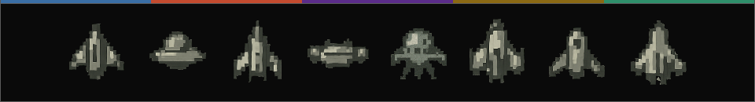

<br/>

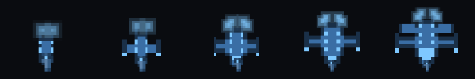

</div>


<div align="center">

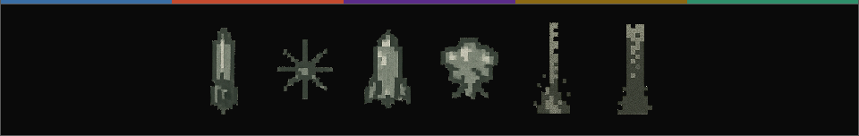

<br/>

`LASER` · `SPREAD` · `RAPID` · `PLASMA` · `MISSILE` · `ION`

</div>


## Combat

Combat is a vertical shooter with a readable pixel hierarchy:

- Five factions × five hostile classes: scout, assault, heavy, elite, capital.
- Faction silhouettes use topology and plating so shape communicates doctrine.
- Champions can announce escorts: repair drones, shield batteries, gunners,
  jammers, and tethers. Side-boss difficulty and faction boss kits are split so
  champion pressure scales independently of the main wave.
- **Scrolling terrain** walls carve flight lanes (canyons, narrows, teeth, reefs)
  tinted by the planet and the holding faction. Material weights mix rock,
  metal, **crystal**, and magma; crystals prism and shatter into shards.
- Rocks take **weapon-scaled damage**, splash, and shed collidable chunks; debris
  is visual-only chip FX in the rock's own colours.
- **Planet tiers** (Easy → Nightmare) scale enemy health, speed, damage, and spawn
  cadence so early theaters forgive and late ones punish.
- **Stage count** varies by planet difficulty (roughly 2–5 stages + boss); later
  stages raise terrain danger and harsh flight zones.
- Victory and defeat screens show an **outcome stepper** for the planet just
  fought (cleared / current WON·LOST / locked). A refresh restores the same
  end overlay (score / time / kills) instead of dumping back to the menu.
- **Boss stages** after the regular clear: multiphase patterns, escort calls, and
  a dedicated HP bar — bosses ignore the normal lane shooter loop.
- **Supply crates** drop random timed power-ups: **POWER SHOT**, **RAPID FIRE**,
  or **BARRIER** (half damage taken), each with HUD notice and icon glow.
- Enemy waves use **seeded liveries** so ships of one faction still look distinct;
  renegade contract targets get outlaw markings (hazard slash, crossed badge).
- Normal and escort spawns **dive in from above**, then lock into cruise /
  formation slots. Active craft stay **fully inside** the playfield rim.
- **Field presence:** combat (shots, jammer, tether) only while fully on-screen.
  Entering and fleeing hulls do not fire; off-screen ships are culled so HUD bars
  and clear checks finish. Late / stuck escorts get a hard flee kick.
- Scheduled sides stop spawning once the objective is won or awaiting field clear.
- Faction contracts can spawn **renegade captains** or **outlaw gangs** with their
  own callsigns and paint.
- Ambush encounters can roll a raider boss, a pirate pack, or a light swarm.
- Weapons, abilities, shields, charge, drive, pickups, and explosion FX form the
  moment-to-moment combat layer. Hit bursts stay compact so silhouette reads.
- Victory loot pays resources, credits, blueprint progress, and active mission
  rewards; the scoop phase ends as soon as the field is clear (idle vacuum for
  stranded drops; bosses keep a longer safety net).

### Playfield and VOXEL combat

Viewport fit is **playfield-first**: the fight canvas takes nearly full column
height, aspect sets width, leftover width feeds clamped side HUD panels, and
VOXEL mode snaps CSS size to integer-divisor lattice steps.

Ship Render **FLAT** / **VOXEL** shares one combat lattice cell (settings
**Voxel Size** from 0.25–8). Ships, modules, terrain, obstacles, particles, and
debris snap to that cell; VOXEL lowers supersampling when cells are large.
Destroyed hulls shed **silhouette-sampled voxel chips** with a hot core burst.
**GUI voxel** can pixelate chrome lines independently of ship render style.

### Look FX and size overlay

Bezel **FX** and Settings expose glow, scanlines, CRT, chroma, **vignette**,
**noise**, **flicker**, **bloom**, and **HDR** (percent strength; area SCREEN /
FRAME / BOTH). Font sizes cover h1–small plus a separate **game HUD** scale;
families can override per size. The in-game **SIZES** overlay sets exact pixel
widths for player, enemy classes, and shots, plus shot-speed percent.

## Screenshots

Live captures from the current build (station shell, factions, travel, combat).

<div align="center">

| Home Station | Galaxy travel |
|:---:|:---:|
| 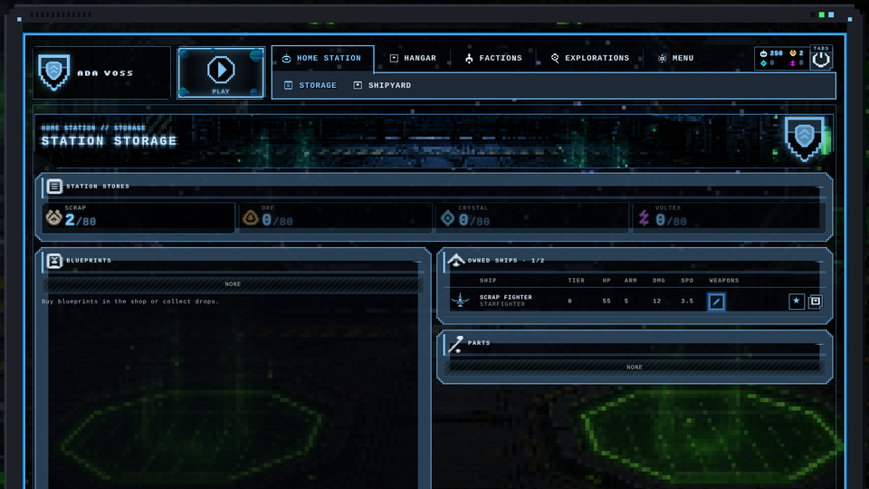 | 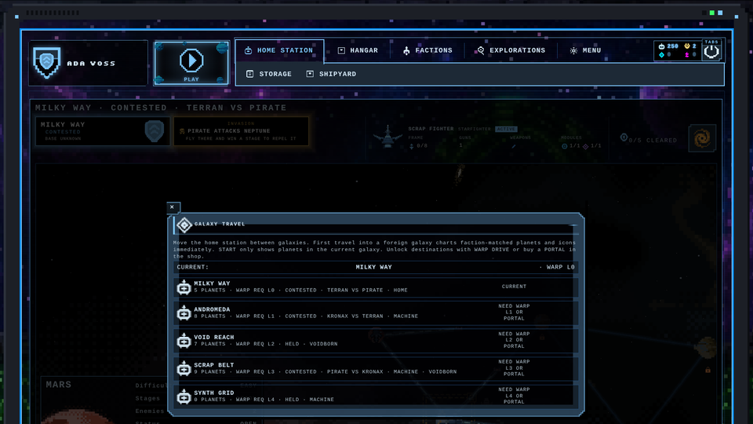 |
| Upgrade tree | Combat focus |
| 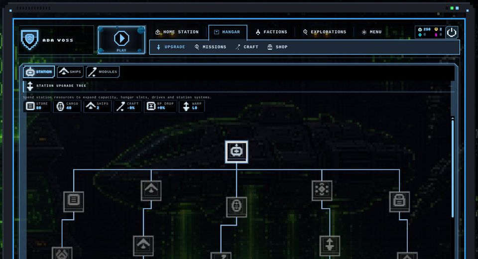 | 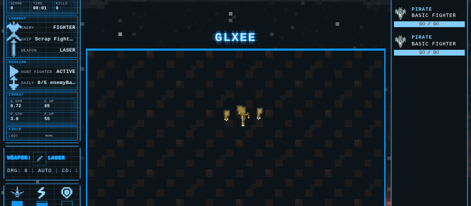 |
| Factions (hi-res emblems) | Emblem strip |
|  |  |

<br/>


<br/>


<br/>


<br/>

**Play:** [meierdesigns.itch.io/glxee](https://meierdesigns.itch.io/glxee)

</div>

## Features

Short index — details live in the sections above.

- Five factions / galaxies with relations, contracts, trade, fleet preview, universe save.
- Home Station loop: upgrade, hangar, shop, craft, missions, factions, PLAY launch.
- Modular loadouts, area pager, hangar bay zoom, VOXEL combat with field presence.
- Galaxy explore: one-pixel-size map, stored nebulae, checkpoints, traffic, ship locator.
- 4:3 stage, pixel-frame bezel, pilot HUD, expanded look FX, boot loading screen.
- Local HTTP/1.1 `npm start`; end screens restore across refresh; optional ComfyUI.

### Current build focus

```text
LOOK    ── FX plate (bloom/HDR/vignette) ── pixel frame ── GUI voxel ── font scales
   │
MAP     ── one pixel unit ── stored nebula ── posterised steps ── lighter zoom
   │
FLEET   ── player ship in preview ── live colour overrides
   │
MATCH   ── restore victory/game-over after refresh ── map opens on the fought planet
   │
BOOT    ── fight screen hidden until shown ── nebula prepared during menu build
```

Recent waves unify the map pixel size, store and thin out the nebula, speed up
zoom, keep the fight screen from flashing on reload, fix overlays hidden behind
the fight screen, sweep fast shots against targets, and rework HUD and bezel look.


## Architecture

GLXEE deliberately remains a script-loaded browser project. Large systems are
split into focused folders while their public entry points remain stable.

```text
index.html                 dependency-ordered entry point
styles.css                 pixel UI, station, hangar, and faction chrome
css/                       fonts, screen-frame, pilot-hud, variables, asset-gen

js/core/                   state, configs, stage-boot, boot-loader, viewport-fit, loop
js/game/                   player, enemies, bullets, collisions, obstacles, audio
js/graphics/               sprites, palettes, silhouettes, effects, renderers
js/ui/                     station, hangar, editors, viewers, maps, menus
js/abilities/              ability definitions and player abilities
assets/                    fonts, sprites, ship models, modules, levels, metadata

docs/                      architecture, technical notes, updates, devlogs
rules/                     game rules and tactical design notes
tools/                     HTTP/1.1 dev-server, ComfyUI, asset-gen, icon-preview
packages/                  Cursed IDE packages
```

### Module convention

A large system such as `js/ui/home-station.js` keeps its entry point and stores
focused methods in `js/ui/home-station/`:

```text
js/ui/home-station/core.js
js/ui/home-station/render-hangar-tab.js
js/ui/home-station/hangar-parts-grid.js
js/ui/home-station/area-upgrades.js
js/ui/home-station.js
```

`core.js` establishes the class. The focused files extend it with
`extendClass(...)`. `index.html` loads the parts in dependency order, followed
by the entry file. ES modules such as the ship asset loader import their own
parts.

Keep new methods near related methods and split a file before it becomes hard
to review. Runtime data follows the same pattern in config, sprite, and
profile-manager folders.


## Development waves

Changes are committed by feature so each slice has a readable history and can
be reviewed or reverted independently.

| Wave | Feature | Scope |
|:-----|:--------|:------|
| 39A–39E | Runtime modularization | Core, combat, graphics, UI, shell, and docs split into focused modules |
| 40A–40C | Anatomy and station controls | Voxel hulls, hangar editing, dialogs, themes, and navigation |
| 41A–41D | Rendering, travel, combat, commerce | Scale2x ships, galaxy travel, combat progression, trading posts, cosmetics |
| 42A–42C | Area and armament systems | Hull areas, Parts workspace, slot mounting, faction weapons, hangar polish |
| 43A | Loadout integration | Slot sizes, weapon mounts, ability integration, faction hull builders |
| 43B | Missions and relations | Mission board, faction reputation, contracts, bounty hunts, trade terms |
| 43C | Station mission UI | Missions, faction relations, faction trade, contract tabs, hangar slot bar |
| 44A | Galactic control | Faction holdings, expanding stations, base raids, invasions, contested galaxies |
| 44B | Combat presentation | Weapon slot purchases, bounded mounts, full-sprite weapons, collision-safe placement |
| 44C | Station UX | Resizable sidebars, hangar layout polish, profile flow, palette and menu refinements |
| 45A | Combat staging | Enemy lanes, victory handoff, loot timing, pickup and collision polish |
| 45B | Galaxy routing | Arrival sectors, route preview, galaxy state, and parallax handoff refinements |
| 45C | Hangar presentation | Power budget, slot fit states, parts presentation, and test-arena polish |
| 47A | Pilot readouts | Profile scoring, ability stats, combat progression, and loadout feedback |
| 47B | Planet theaters | Galaxy navigation, animated planet frames, and faction visual treatments |
| 47C | Station presentation | Fleet previews, HD navigation icons, start intro, and hangar shell polish |
| 48C–48K | Shell zoom era | 75% GUI baseline, browser zoom coexistence, responsive viewport fit, `.vf-browser-shell` |
| 49A | README visual refresh | Live sprite strips for fleet, planets, and weapons plus updated terminal banner chrome |
| 49B | Live README screenshots | Capture station, factions, galaxy travel, and Mars combat into the GitHub archive |
| 50 | Live README strips | Replace old planet/weapon/ship gallery sprites with combat-renderer and SVG exports |
| 51A | Hi-res emblems | Hand-shaded 32×32 faction emblems and resource icons on the `@2x`/`@4x` path |
| 51B | Zoom-safe pointers | Patch CSS-zoom rect drift so hit tests match visual pixels across engines |
| 51C | Scrolling terrain | Destructible rocks, debris, planet-tinted walls, and flight-lane patterns |
| 51D | Bosses and planet tiers | Difficulty curve, multiphase bosses, ambush flavours, enemy steering |
| 51E | Supply crates | Timed power-shot crates, boosted bullet glow, and faster victory scoop |
| 51F | Galaxy explore polish | Faction station borders, stage progress, and explore-map refinements |
| 51G | Station and HUD polish | Weapon keys, shield vitals, hangar tips, and combat info panel readability |
| 51H | README wave archive | Hi-res emblem screenshots and expanded combat/docs for waves 51A–51G |
| 51I | Live screenshot refresh | Recapture station, upgrade, galaxy, factions, and Mars combat with terrain |
| 52A | PLAY launch | Dedicated header/menu PLAY control; remove PLAY from station sub-tabs |
| 52B | Border checkpoints | Faction silhouette borders, fly/dock/raid/assault confirms, planet atmo haze |
| 52C | Station and map chrome | Area-tab corner deco, faction station fills, selection frames, PLAY styling |
| 52D | README travel archive | Document PLAY launch, border actions, and explore-map chrome for waves 52A–52C |
| 53A | Shared world ownership | Global planet owners, galaxy generation, warp tiers, control presets |
| 53B | Invasions and liveries | Ally defense invasions, renegade/gang contracts, seeded enemy paint |
| 53C | Multi power-ups | Crate drops for power shot, rapid fire, and barrier with HUD cues |
| 53D | Stage progression | Variable stage counts, stage-scaled terrain, victory/defeat outcome stepper |
| 53E | GALAXIES viewer | Main-menu galaxy browser and custom start-galaxy creation modal |
| 53F | Explore map sync | Ownership/invasion cues, battle marks, and travel confirm polish |
| 53G | Shell chrome | Fullscreen toggle, game-over wreck, reload keys, and UI styling |
| 53H | README world archive | Document shared world, power-ups, stages, and GALAXIES for waves 53A–53G |
| 54A | Pirate emblem | Angular void-skull boarding seal at 16px and hi-res `@4x` |
| 54B | GUI scale slider | Persistent 50–125% shell zoom via frame slider and uiAppearance |
| 54C | Map traffic and locator | Bidirectional route packets, ship locator, zoom detail, barrier depth |
| 54D | Faction fleet zoom | Fleet preview zoom controls and accented faction-viewer emblems |
| 54E | Hangar edge drag | Pointer-locked frame resize at every existing scale |
| 54F | Map and station chrome | GUI slider, ship locator, traffic, fleet zoom, and viewer accents |
| 54G | README map polish | Document pirate seal, GUI slider, locator, and fleet zoom for 54A–54F |
| 55A | Boot noise quiet | FOUC zoom, AudioContext, and YouTube cookie console noise |
| 55B | Module cost ramp | Stronger late-level area and slot upgrade prices |
| 55C | Hit explosion shrink | Compact hit bursts for clearer combat silhouette feedback |
| 55D | Size settings overlay | Enemy, player, and shot size steps with in-game SIZE overlay |
| 55E | Champion boss kits | Split side-boss difficulty and faction-specific boss kits |
| 56A | Local fonts and server | Self-hosted Silkscreen, boot veil, revalidating `npm start` |
| 56B | Playfield-first viewport | Fight canvas fills column height; leftover width feeds side HUD |
| 56C | VOXEL combat lattice | Shared cell size, lower supersample, silhouette voxel debris |
| 56D | Exact sizes and borders | Pixel width/speed overlay, thicker borders, FX percent strength |
| 56E | Crystal terrain | Crystal/metal/magma materials, prism obstacles, shatter shards |
| 56F | Menu and profile chrome | NEW PILOT, locked LOAD, HD icons, profile tiles, progress bars |
| 56G | Map ruler and universe | Explore chip, stage ruler bar, galaxy viewer state, universe JSON |
| 56H | Station builders | Trading-post builder memory, edge-aware posts, column resize |
| 56I | Combat entry polish | Dive-in spawns, faster victory scoop, loot idle vacuum |
| 56J | README archive | Document boot, VOXEL fight, sizes, crystals, and universe for 55–56 |
| 57A | Fixed stage bezel | 4:3 logical stage, faction bezel, RES slider, pre-paint `stage-boot` |
| 57B | Hangar area pager | One open hull area at a time; pinned prev/next above the ship list |
| 57C | Hangar bay zoom | Whole-pixel zoom steps above 1×; smooth shrink to 12 % below |
| 57D | Pilot flow restore | Resume unfinished New Pilot faction/name steps after reload |
| 57E | Combat present polish | Fine rock fireballs, wreck fly-in lane, VOXEL default |
| 57F | README stage archive | Document stage bezel, hangar pager, and zoom for waves 57A–57E |
| 58A | Stage window fill | Scale the 4:3 stage to 95 % of the window in boot and viewport-fit |
| 58B | Station tab align | Align tab/PLAY row to content; skip redundant nav tooltips |
| 58C | Side enemy cull | Drop off-screen side enemies so HUD bars and clear checks finish |
| 58D | PLAY shell chrome | Calmer PLAY frames, nav cards without inset glow rings |
| 58E | README station archive | Document 95 % fill, tab align, and PLAY chrome for 58A–58D |
| 59A | Boot loading screen | First-paint progress panel with resource phases until menu restore |
| 59B | HTTP/1.1 dev server | Keep-alive, quiet logs, daemon threads for hundreds of static files |
| 59C | Screen frame and HUD | Shared `--fr-shape` bezel plates plus split pilot crest/resource screens |
| 59D | Calm refresh veil | Hide progress panel on same-tab refresh; keep bezel above the cover |
| 59E | Sub-nav body bridge | Active area card opens into the body when no sub-nav exists |
| 59F | README frame archive | Document screen-frame, pilot HUD, and calm refresh for 59B–59E |
| 60A | Field presence combat | On-screen-only shots/roles, hard flee kick, stop sides after win |
| 60B | README cleanup | Trim Features index; document field presence for wave 60A |
| 61A | Pixel frame and FX plate | Raster bezel lattice, frame style editor, bezel FX tool, typed colour fades |
| 61B | Look FX expand | Vignette/noise/flicker/bloom/HDR, GUI voxel, finer Voxel Size, font/game scales |
| 61C | Map pixel nebulae | Shared map pixel unit, tiled nebula patches, sun-gated swirls |
| 61D | Fleet preview player | Pilot ship in faction preview, live colour overrides, player-only filter |
| 61E | End screen restore | Persist and restore victory/game-over across refresh |
| 61F | Shot sweep and terrain | Bullet sweep hit tests; boss arenas keep scrolling terrain |
| 61G | README look archive | Document pixel frame, FX, map, fleet preview; compress shell-zoom wave rows |
| 62A | Stored nebula and map pixel | One map pixel unit, stored/prewarmed nebula, posterised steps, lighter zoom |
| 62B | Boot and map return | Fight screen hidden until shown; map opens on the fought planet |
| 62C | Combat sweep and spawns | Swept shot hits, scheduled spawns, editor shot preview, playfield defaults |
| 62D | HUD rework | Level info HUD, tooltips, pilot HUD |
| 62E | Bezel and look polish | Pause screen in the glass, victory/pause layering, icons, start-screen fonts |
| 62F | Station and editors | Station tabs, editors, economy stats, ship asset sprites |
| 62G | README map archive | Document nebula storage, map pixel unit, boot and map-return behaviour |
| 63A | Map routes and stations | Detour arcs around obstacles, per-galaxy camera and selection, orbiting stations, JUMP TO unlock hint |
| 63B | Pilot creator | Pilot step with generated helmet portrait and sliders, galaxy icon, startup sound, faction card layout |
| 63C | Station and perf | Faction hero portraits, contract weapon rewards, PERF switches, calmer hangar parts, explosion loot timing |
| 63D | README pilot archive | Document map routes, pilot creator and the 63A–63C changes |

The wave commit convention is:

```text
feat: <feature> wave <id>
docs: document <feature> wave <id>
```

## Documentation

- [Architecture](docs/ARCHITECTURE.md) — project layout and module conventions.
- [Technical notes](docs/TECHNICAL.md) — implementation details.
- [Update notes](docs/UPDATE_NOTES.md) — historical gameplay waves.
- [Devlog 1](docs/ITCH_DEVLOG_01.md) — faction silhouettes and combat identity.
- [Devlog 2](docs/ITCH_DEVLOG_02.md) — modular runtime refactor.
- [Devlog 3](docs/ITCH_DEVLOG_03.md) — living galaxies, hangar engineering, and the new GLXEE README style.
- [Git deployment strategy](docs/git-deployment-strategy.md) — feature-wave workflow.
- [Game rules](rules/game-rules.md) — design rules and tactical constraints.
- [Assets](assets/README.md) — asset database and generation notes.
- [ComfyUI / asset-gen](tools/comfyui/README.md) — optional asset tooling.

## Lore

In 2187, the discovery of Voltex Crystals turned every jump lane into
contested ground. The Terran Concord protects the Milky Way, Kronax packs raid
Andromeda, Voidborn fleets fold through cold rings, Pirate freebooters weld
ships in the Scrap Belt, and the Machine Collective expands through the Synth
Grid.

Every faction wants the same glowing dust. Pilots claim planets, sign pacts,
run contracts, and learn that every silhouette on the scanner is a doctrine —
not merely a hull.

For the full contact archive, see the faction entries in the original update
notes and the [GLXEE devlogs](docs/).

## Credits

**GLXEE** — created by Lance Meier / [meierdesigns](https://github.com/meierdesigns)

- Play: [meierdesigns.itch.io/glxee](https://meierdesigns.itch.io/glxee)
- License: MIT
- Runtime: browser
- Repository: [github.com/meierdesigns/GLXEE](https://github.com/meierdesigns/GLXEE)
