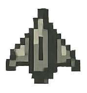
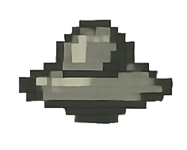
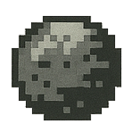
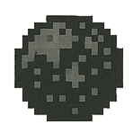

<div align="center">


# GLXEE

**A browser-based Game Boy–shell space shooter about factions, loadouts, and the next jump.**

[](#boot)
[](#credits)
[](#credits)

</div>

GLXEE is a no-build browser shooter. Choose a faction, assemble a ship from
area-sized modules, clear planets, earn contracts, trade with allies, and travel
through five faction-themed galaxies. Its identity is carried by pixel shapes,
not just color: every faction has its own silhouette, doctrine, and visual
language.

```text
╭────────────────────────────── VOLTEX CHANNEL ──────────────────────────────╮
│  PILOT STATUS   READY                                                       │
│  THEATER         MILKY WAY · MARS                                           │
│  LOADOUT         NOSE  M   CORE  S   AFT  M   WINGS  S/S                    │
│  OBJECTIVE       CLEAR THE STAGE · CLAIM THE LOOT                           │
│  NEXT JUMP       HOME STATION → TRAVEL → UNKNOWN SECTOR                     │
╰─────────────────────────────────────────────────────────────────────────────╯
```

<div align="center">






<br/>

`STARFIGHTER` · `INTERCEPTOR` · `MARS` · `PLUTO`

</div>

> **Design rule:** the README follows the game loop. Boot and controls come
> first, systems are described once in their owning section, and development
> history stays at the end.

## Contents

- [Boot](#boot)
- [Controls](#controls)
- [The game loop](#the-game-loop)
- [Factions and galaxies](#factions-and-galaxies)
- [Home Station and hangar](#home-station-and-hangar)
- [Combat](#combat)
- [Features](#features)
- [Architecture](#architecture)
- [Development waves](#development-waves)
- [Documentation](#documentation)
- [Lore](#lore)
- [Credits](#credits)

## Boot

Requirements: **Python 3**. There is no build step and no dependency install.

```bash
npm start
# http://localhost:3000
```

Equivalent command:

```bash
python3 -m http.server 3000
```

Optional local tools:

```bash
npm run assets          # ComfyUI + asset-gen bridge
npm run comfy           # ComfyUI workflows
npm run asset-gen       # asset-gen bridge on :8787
npm run icons:preview   # render icon previews
```

`npm start` is a static file server. It must be run from the repository root.

## Controls

| Input | Action |
|:------|:-------|
| Arrow keys / WASD | Move |
| Space | Fire; hold to charge |
| Shift | Charge Drive boost |
| Q / E | Cycle weapons |
| Escape | Pause; switch menu groups in the station |
| Ctrl + 1–8 | Select color palette |
| `#` or Settings → Assets | Open Asset Generator |
| Settings → Faction | Open Faction Command |

Menu navigation is keyboard-first: arrow keys move focus, Enter confirms, and
Escape closes the active overlay. Text fields keep their normal caret controls.

## The game loop

```text
Choose profile
    ↓
Home Station: upgrade · shop · craft · hangar · missions · factions
    ↓
Accept a planet, faction, or bounty contract
    ↓
Travel / launch → clear stages → collect loot and mission rewards
    ↓
Upgrade hull areas and slots · trade · change the loadout · jump again
```

A mission is either a **LIBERATE** run on an uncleared planet or a lower-paying
**PATROL** on a cleared one. One mission can be active at a time. Faction
contracts can target reachable galaxies and may teleport the pilot before launch.

## Factions and galaxies

Five factions define the main theaters. Their silhouette rules, procedural planet
styles, enemy pools, and strategic goals are shared by combat and exploration.

| Faction | Galaxy | Silhouette language | Doctrine |
|:--------|:-------|:--------------------|:---------|
| **Terran** | Milky Way | Modular plates | Engineers, escorts, safe lanes |
| **Kronax** | Andromeda | Claws and spikes | Ambush, speed, war packs |
| **Voidborn** | Void Reach | Broken rings | Fold-space, silent fleets |
| **Pirate** | Scrap Belt | Asymmetric scrap | Salvage, black docks, mutiny |
| **Machine** | Synth Grid | Circuit grids | Logic, forge nodes, replication |

Foreign galaxies begin with generated arrival sectors. Faction themes seed
planet names, obstacle doctrine, enemy compositions, icons, and background
patterns. Reputation ranges from -100 to +100; allegiance, pacts, and contracts
change whether a faction trades and which prices it offers.

### Faction relations and contracts

The Home Station Factions area has three focused views:

- **Relations:** reputation meter, allegiance, pacts, controlled planets, and lore.
- **Trade:** faction specialties, demanded resources, buy/sell quotes, and relation discounts.
- **Contracts:** faction jobs and bounty hunts in reachable galaxies.

Contracts pay credits and materials when the target planet stage is cleared and
raise reputation with the issuing faction.

### Galactic control

Each galaxy has a faction ruler, a hidden base, and a faction-specific expansion
pattern. Flights and cleared battles advance the control simulation:

- factions found outposts, war camps, sanctums, hideouts, or relays;
- holdings add defenders and faction-specific parts to their trading stations;
- stations can be raided, and destroying every station exposes the base;
- destroying the base changes a held galaxy to contested control;
- a new profile begins with a seeded home-galaxy invasion that can be repelled
  for an opening reward.

## Home Station and hangar

The station is the progression hub:

| Area | Purpose |
|:-----|:--------|
| Station | Overview, cargo, and current status |
| Upgrade | Hull-area and slot-size upgrades |
| Hangar | Ship editor, loadout, parts workspace, and test arena |
| Shop | Ships, blueprints, modules, and style unlocks |
| Craft | Unlock hulls and equipment from blueprints |
| Travel | Galaxy map and arrival sectors |
| Explorations | Ships, planets, enemies, factions, and events |
| Missions | Liberate / patrol board and mission rewards |

### Hull areas and slots

Every ship has four areas: **NOSE**, **CORE**, **AFT**, and **WINGS**.

- Area upgrades add slots and frame bonuses.
- Individual slots upgrade from **S → M → L**.
- Split wing mounts use mirrored half-size sockets.
- Weapon sockets can be dragged between nose, core, and wings when space allows.
- Area toggles can hide nose, aft, or wing sections and safely remap modules.
- The hangar Parts view shows inventory, fit status, slot size, and drag targets.

The loadout is persistent per profile and per ship. It includes weapon mounts,
module offsets, slot upgrades, anatomy settings, cosmetic skins, wing variants,
connection settings, and disabled areas.

## Combat

Combat is a vertical shooter with a readable pixel hierarchy:

- Five factions × five hostile classes: scout, assault, heavy, elite, capital.
- Faction silhouettes use topology and plating so shape communicates doctrine.
- Champions can announce escorts: repair drones, shield batteries, gunners,
  jammers, and tethers.
- Wave direction and obstacle patterns vary encounters.
- Weapons, abilities, shields, charge, drive, pickups, and explosion FX form the
  moment-to-moment combat layer.
- Victory loot pays resources, credits, blueprint progress, and active mission
  rewards.

The combat renderer uses a shared ship voxel lattice, faction hull builders,
Scale2x refinement on high-density displays, pixel snapping, and authored full
sprites where segmented rendering would distort a faction silhouette.

## Features

- Five faction identities with emblems, lore, relations, pacts, contracts, and trade.
- Five galaxies with procedural foreign-galaxy arrival sectors.
- Home Station progression: shop, craft, upgrade, hangar, travel, missions, and archives.
- Persistent profile progression with resources, credits, discoveries, missions, and loadouts.
- Four upgradeable hull areas plus individual S/M/L slot upgrades.
- Weapon slots can be purchased per ship, mounted in the nose, core, or wings,
  and protected from overlapping through bounded drag placement.
- Drag-and-drop hangar Parts workspace and movable weapon sockets.
- Mirrored wing placement, faction weapon mounts, visual module integration, and cosmetic skins.
- Faction-specific weapon mount art and full-sprite fallback rendering for
  procedural ships.
- Resizable station sidebars with remembered widths and responsive hangar panels.
- Procedural planet SVGs, parallax station decks, palette editors, and global look persistence.
- Combat events, champion escorts, patterned obstacles, pickups, loot, and Web Audio SFX.
- Optional YouTube soundtrack / beat-sync layer.
- Optional ComfyUI and asset-generation bridge.
- Cursed IDE packages under `packages/`.

### Current build focus

```text
HANGAR  ── size-aware slots ── weapon mounts ── power budget ── test arena
   │
TRAVEL  ── route preview ── arrival sector ── encounter staging ── mission loot
   │
COMBAT  ── wave direction ── enemy lanes ── pickups ── victory handoff
```

## Architecture

GLXEE deliberately remains a script-loaded browser project. Large systems are
split into focused folders while their public entry points remain stable.

```text
index.html                 dependency-ordered entry point
styles.css                 pixel UI, station, hangar, HUD, and faction chrome
css/                       optimized variables and asset-generator styles

js/core/                   state, configs, input, economy, profiles, loop
js/game/                   player, enemies, bullets, collisions, obstacles, audio
js/graphics/               sprites, palettes, silhouettes, effects, renderers
js/ui/                     station, hangar, editors, viewers, maps, menus
js/abilities/              ability definitions and player abilities
assets/                    sprites, ship models, modules, levels, metadata

docs/                      architecture, technical notes, updates, devlogs
rules/                     game rules and tactical design notes
tools/                     ComfyUI, asset-gen, and icon-preview tooling
packages/                  Cursed IDE packages
```

### Module convention

A large system such as `js/ui/home-station.js` keeps its entry point and stores
focused methods in `js/ui/home-station/`:

```text
js/ui/home-station/core.js
js/ui/home-station/render-hangar-tab.js
js/ui/home-station/hangar-parts-grid.js
js/ui/home-station/area-upgrades.js
js/ui/home-station.js
```

`core.js` establishes the class. The focused files extend it with
`extendClass(...)`. `index.html` loads the parts in dependency order, followed
by the entry file. ES modules such as the ship asset loader import their own
parts.

Keep new methods near related methods and split a file before it becomes hard
to review. Runtime data follows the same pattern in config, sprite, and
profile-manager folders.

## Development waves

Changes are committed by feature so each slice has a readable history and can
be reviewed or reverted independently.

| Wave | Feature | Scope |
|:-----|:--------|:------|
| 39A–39E | Runtime modularization | Core, combat, graphics, UI, shell, and docs split into focused modules |
| 40A–40C | Anatomy and station controls | Voxel hulls, hangar editing, dialogs, themes, and navigation |
| 41A–41D | Rendering, travel, combat, commerce | Scale2x ships, galaxy travel, combat progression, trading posts, cosmetics |
| 42A–42C | Area and armament systems | Hull areas, Parts workspace, slot mounting, faction weapons, hangar polish |
| 43A | Loadout integration | Slot sizes, weapon mounts, ability integration, faction hull builders |
| 43B | Missions and relations | Mission board, faction reputation, contracts, bounty hunts, trade terms |
| 43C | Station mission UI | Missions, faction relations, faction trade, contract tabs, hangar slot bar |
| 44A | Galactic control | Faction holdings, expanding stations, base raids, invasions, contested galaxies |
| 44B | Combat presentation | Weapon slot purchases, bounded mounts, full-sprite weapons, collision-safe placement |
| 44C | Station UX | Resizable sidebars, hangar layout polish, profile flow, palette and menu refinements |
| 45A | Combat staging | Enemy lanes, victory handoff, loot timing, pickup and collision polish |
| 45B | Galaxy routing | Arrival sectors, route preview, galaxy state, and parallax handoff refinements |
| 45C | Hangar presentation | Power budget, slot fit states, parts presentation, and test-arena polish |

The wave commit convention is:

```text
feat: <feature> wave <id>
docs: document <feature> wave <id>
```

## Documentation

- [Architecture](docs/ARCHITECTURE.md) — project layout and module conventions.
- [Technical notes](docs/TECHNICAL.md) — implementation details.
- [Update notes](docs/UPDATE_NOTES.md) — historical gameplay waves.
- [Devlog 1](docs/ITCH_DEVLOG_01.md) — faction silhouettes and combat identity.
- [Devlog 2](docs/ITCH_DEVLOG_02.md) — modular runtime refactor.
- [Git deployment strategy](docs/git-deployment-strategy.md) — feature-wave workflow.
- [Game rules](rules/game-rules.md) — design rules and tactical constraints.
- [Assets](assets/README.md) — asset database and generation notes.
- [ComfyUI / asset-gen](tools/comfyui/README.md) — optional asset tooling.

## Lore

In 2187, the discovery of Voltex Crystals turned every jump lane into
contested ground. The Terran Concord protects the Milky Way, Kronax packs raid
Andromeda, Voidborn fleets fold through cold rings, Pirate freebooters weld
ships in the Scrap Belt, and the Machine Collective expands through the Synth
Grid.

Every faction wants the same glowing dust. Pilots claim planets, sign pacts,
run contracts, and learn that every silhouette on the scanner is a doctrine —
not merely a hull.

For the full contact archive, see the faction entries in the original update
notes and the [GLXEE devlogs](docs/).

## Credits

**GLXEE** — created by Lance Meier / [meierdesigns](https://github.com/meierdesigns)

- License: MIT
- Runtime: browser
- Repository: [github.com/meierdesigns/GLXEE](https://github.com/meierdesigns/GLXEE)
